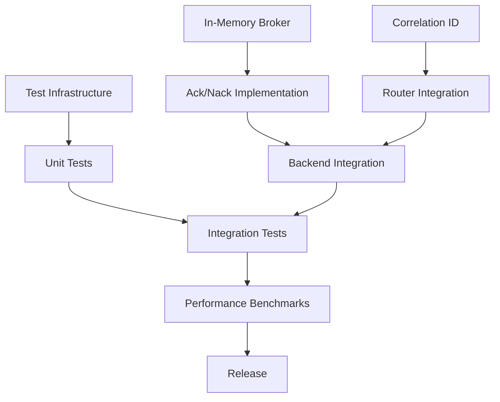

# Kincir v0.2 Project Tracking

## Sprint Planning

### Sprint 1 (Week 1): Foundation
**Duration**: 5 days  
**Focus**: Core infrastructure and in-memory broker

#### Day 1-2: In-Memory Broker + Correlation ID (Parallel)
- [ ] **Task 1.1**: InMemoryBroker core infrastructure
- [ ] **Task 1.2**: InMemoryPublisher implementation
- [ ] **Task 3.1**: Correlation context and ID generation
- [ ] **Task 3.2**: Message struct enhancement

#### Day 3-4: Complete In-Memory + Start Ack/Nack
- [ ] **Task 1.3**: InMemorySubscriber implementation
- [ ] **Task 1.4**: Advanced in-memory features
- [ ] **Task 2.1**: Enhanced Subscriber trait design
- [ ] **Task 3.3**: Context propagation implementation

#### Day 5: Integration and Testing
- [ ] **Task 1**: In-memory broker testing and integration
- [ ] **Task 3.4**: Router integration for correlation IDs
- [ ] **Task 5.1**: Basic test infrastructure setup

### Sprint 2 (Week 2): Ack/Nack and Backend Integration
**Duration**: 5 days  
**Focus**: Unified acknowledgment handling

#### Day 6-7: Ack/Nack Core
- [ ] **Task 2.2**: In-memory ack/nack implementation
- [ ] **Task 2.3**: RabbitMQ ack/nack implementation
- [ ] **Task 5.2**: Unit tests for core components

#### Day 8-9: Backend Completion
- [ ] **Task 2.4**: Kafka ack/nack implementation
- [ ] **Task 2.5**: MQTT ack/nack implementation
- [ ] **Task 5.3**: Backend unit tests

#### Day 10: Router Integration
- [ ] **Task 2.6**: Router ack/nack integration
- [ ] **Task 5.4**: Integration tests
- [ ] **Task 3.5**: Complete correlation ID backend integration

### Sprint 3 (Week 3): Performance and Testing
**Duration**: 5 days  
**Focus**: Benchmarking and comprehensive testing

#### Day 11-12: Performance Infrastructure
- [ ] **Task 4.1**: Benchmark infrastructure setup
- [ ] **Task 4.2**: Core operation benchmarks
- [ ] **Task 5.5**: End-to-end tests

#### Day 13-14: Comprehensive Benchmarking
- [ ] **Task 4.3**: Backend performance benchmarks
- [ ] **Task 4.4**: Feature impact benchmarks
- [ ] **Task 5.6**: Property-based tests

#### Day 15: Advanced Testing and Profiling
- [ ] **Task 4.5**: Advanced profiling and optimization
- [ ] **Task 5.7**: CI/CD integration
- [ ] Final integration testing

### Sprint 4 (Week 4): Polish and Release
**Duration**: 5 days  
**Focus**: Documentation, final testing, and release preparation

#### Day 16-17: Documentation and Examples
- [ ] Update all documentation
- [ ] Create comprehensive examples
- [ ] Performance tuning based on benchmarks

#### Day 18-19: Final Testing and Bug Fixes
- [ ] Address any remaining issues
- [ ] Final performance validation
- [ ] Security review

#### Day 20: Release Preparation
- [ ] Version bump and changelog
- [ ] Release notes preparation
- [ ] Final CI/CD validation

## Task Dependencies

## Risk Assessment

### High Risk Items
1. **Ack/Nack Complexity**: Backend-specific acknowledgment semantics may be more complex than anticipated
   - **Mitigation**: Start with in-memory implementation, thorough research of backend behaviors
   - **Contingency**: Simplify initial implementation, defer advanced features

2. **Performance Targets**: May not meet aggressive performance targets
   - **Mitigation**: Early benchmarking, continuous profiling
   - **Contingency**: Adjust targets based on realistic measurements

3. **Test Stability**: Integration tests with external brokers may be flaky
   - **Mitigation**: Use containerized test environments, implement retry logic
   - **Contingency**: Focus on unit tests, simplify integration test scenarios

### Medium Risk Items
1. **Correlation ID Overhead**: Performance impact may be higher than expected
   - **Mitigation**: Benchmark early, optimize hot paths
   - **Contingency**: Make correlation tracking optional

2. **Backward Compatibility**: Changes may break existing code
   - **Mitigation**: Comprehensive compatibility testing
   - **Contingency**: Provide migration utilities

## Quality Gates

### Sprint 1 Exit Criteria
- [ ] In-memory broker passes all Publisher/Subscriber trait tests
- [ ] Correlation IDs are generated and propagated correctly
- [ ] Basic test infrastructure is operational
- [ ] No critical bugs in core functionality

### Sprint 2 Exit Criteria
- [ ] All backends support ack/nack operations
- [ ] Router integrates with ack/nack system
- [ ] Unit test coverage > 70%
- [ ] Integration tests pass consistently

### Sprint 3 Exit Criteria
- [ ] Performance benchmarks establish baselines
- [ ] Test coverage > 80%
- [ ] Property-based tests validate invariants
- [ ] CI/CD pipeline is fully operational

### Sprint 4 Exit Criteria
- [ ] All documentation is updated
- [ ] Examples demonstrate new features
- [ ] Performance meets or exceeds targets
- [ ] Release is ready for deployment

## Communication Plan

### Daily Standups
- Progress on current tasks
- Blockers and dependencies
- Risk updates
- Resource needs

### Weekly Reviews
- Sprint progress assessment
- Quality metrics review
- Risk mitigation status
- Stakeholder updates

### Milestone Reviews
- Feature completeness assessment
- Performance validation
- Quality gate evaluation
- Go/no-go decisions

## Resource Allocation

### Development Team
- **Lead Developer**: Architecture, complex implementations
- **Backend Specialist**: Kafka/RabbitMQ/MQTT integration
- **Testing Engineer**: Test infrastructure, CI/CD
- **Performance Engineer**: Benchmarking, optimization

### Time Allocation by Category
- **Development**: 60%
- **Testing**: 25%
- **Documentation**: 10%
- **Performance**: 5%

## Success Metrics

### Functional Metrics
- [ ] All planned features implemented
- [ ] Backward compatibility maintained
- [ ] API stability achieved
- [ ] Documentation completeness

### Quality Metrics
- [ ] Test coverage > 80%
- [ ] Zero critical bugs
- [ ] Performance targets met
- [ ] CI/CD success rate > 95%

### Process Metrics
- [ ] On-time delivery
- [ ] Budget adherence
- [ ] Team satisfaction
- [ ] Stakeholder approval

## Contingency Plans

### Schedule Delays
- **Minor (1-2 days)**: Extend current sprint, reduce scope
- **Major (1 week+)**: Re-prioritize features, defer non-critical items

### Technical Blockers
- **Performance Issues**: Implement optimizations, adjust targets
- **Integration Problems**: Simplify implementations, use mocks
- **Test Failures**: Focus on unit tests, simplify integration scenarios

### Resource Constraints
- **Team Availability**: Redistribute tasks, extend timeline
- **Infrastructure Issues**: Use local alternatives, simplify setup

## Post-Release Activities

### Immediate (Week 1)
- [ ] Monitor for critical issues
- [ ] Gather community feedback
- [ ] Address urgent bug reports

### Short-term (Month 1)
- [ ] Performance optimization based on real usage
- [ ] Documentation improvements
- [ ] Community engagement

### Long-term (Quarter 1)
- [ ] Plan v0.3 features based on feedback
- [ ] Ecosystem integration opportunities
- [ ] Performance benchmarking against competitors
